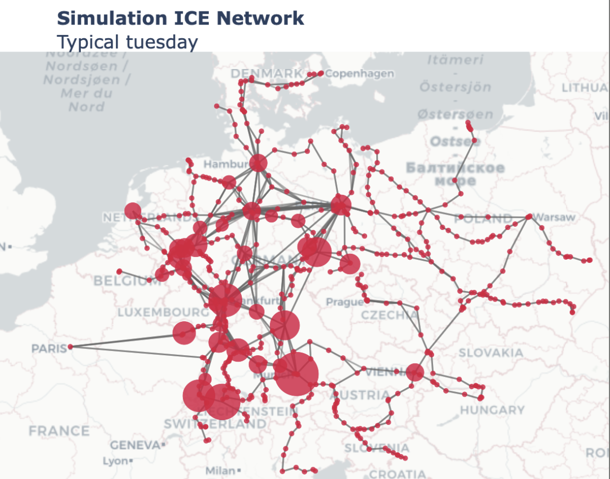
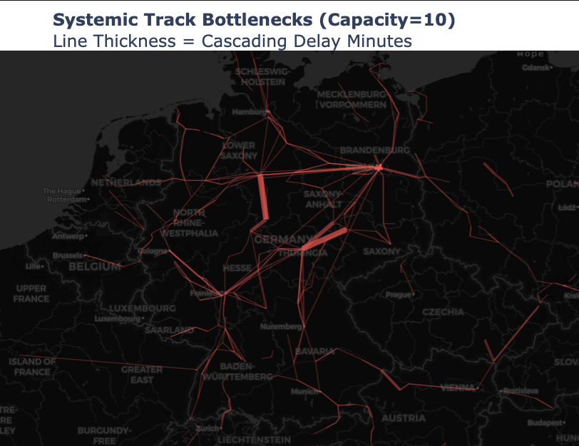
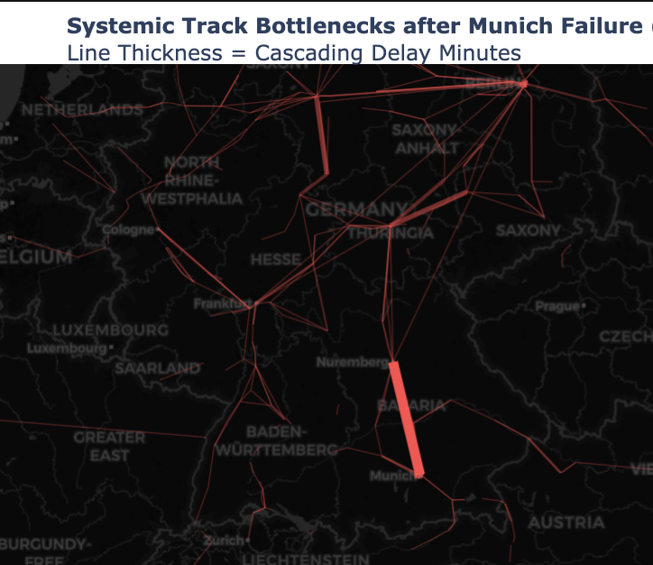

# Simulating Deutsche Bahn’s ICE Network
## CS485: AI and Simulations Final Project
**Author:** Dylan Rybacki 

My final project for the Spring 2026 CS485: AI and Simulations class.

*Visualizing the network used for this simulation*

## Abstract
This project utilizes a Agent-Based Model to simulate Deutsche Bahn's ICE network to help understand where the pain points in the networks are, if increasing track capacities can help remedy delays, and how unfortunate events can propagate through the network.

## Methodology & Architecture
* **Node:** Model stations with simple logical rules like no train can enter when full
* **Edges:** Represent the tracks between stations with a queue logic for trains waiting to enter when the track is at capacity
* **Agents:** The trains using timetable data to navigate the network

## Key Analyses & Findings

### 1. How does track capacity affect network health?
Under perfect mathematical conditions, track capacity (not station capacity) dictates network health. Below a track capacity of 4, the network suffers catastrophic cascading deadlock. Beyond a capacity of 7, the network reaches a functional plateau where delays are minimized strictly to boarding variance.

### 2. Where are the bottlenecks occuring?
Assuming baseline capacity, systemic delays do not distribute evenly. Regions such as **Berlin** and **Halle-Leipzig** function as dense, linear corridors that concentrate track bottlenecks, unlike multi-directional radial hubs (e.g., Frankfurt) which naturally disperse high traffic volume.

*Average simulated delays along tracks between stations*

### 3. How can a failure propagate through the network?
To measure dynamic recovery, a localized 2-hour infrastructure failure was forced at Munich Hauptbahnhof. 

*Delay propagation resulting from a total node failure at Munich Hbf.*

## Technologies Used
* **Python** 
* **Pandas** 
* **Plotly** 
* **matplotlib** 
* **numpy** 

## Setup & Execution
Instruction on running and more detailed analysis of the simulation are found within `simulation.ipynb`.
